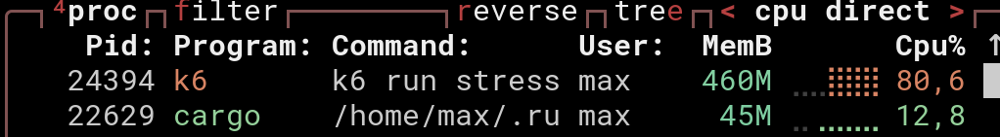

# Microservice Performance Benchmarks

This project is designed to quickly compare the implementation of microservices across different programming languages (C#, Java, Python, C++, Rust). Each microservice provides the current Bitcoin spread from Binance by connecting to Binance via WebSocket, fetching the Best Bid Offer (BBO), calculating the spread, and exposing an endpoint to query this data.

To ensure the comparison is straightforward and easy to understand, the code for each language is contained within a single file. This approach emphasizes simplicity and clarity rather than an extensive exploration of the best practices or full optimization for each language.

Benchmarking
The goal is to evaluate and compare several factors, including:How long it takes to implement the microservice in each language, assessing the difficulty level of implementation, requests per second: Measuring how many requests per second each microservice can handle, latency: Evaluating the response time of each microservice, measuring the time it takes to deserialize data received from Binance, the implementations are reasonably optimized but not pushed to their full potential, as the focus is on a balanced comparison without delving into complex optimizations for each language.

Stress Testing
Stress testing was conducted using wrk, a highly efficient tool for load testing. Each test ran for 5 minutes, with configurations increasing the number of threads and connections across four test runs. The idea was to observe how each implementation handles different loads, analyzing: Latency, requests per second, CPU and memory usage.
In comparison, k6 was also considered for stress testing. However, it consumed more machine resources than the microservices themselves, making it unsuitable for these testsAdditionally, JMeter was tested but was found to be the least efficient option for this type of benchmarking.



Deserialization and Message Logging Test
In addition to stress testing, each microservice continuously receives data from Binance, deserializes it, and logs the output. The deserialization time and the timestamp of when the message is received are measured for each application. This test is performed with all applications running simultaneously but without using the microservices' endpoints. Instead, the focus is purely on analyzing the logs generated by each application to compare the languages' performance in deserializing and processing real-time data.


## To run C++

### Requirements

Make sure you have the following tools and libraries installed on your system:

- **CMake** (version 3.10 or higher)
- **C++ Compiler** (compatible with C++11 or higher)
- **Boost Libraries**
- **OpenSSL**
- **WebSocket++**

### Installing Dependencies

To install dependencies, you can use the following commands:

```sh
sudo apt-get update
sudo apt-get install cmake g++ libboost-system-dev libssl-dev 
sudo apt-get install libwebsocketpp-dev nlohmann-json3-dev
```

### Building the Project

#### 1. Create a build directory and navigate to it:
```sh
mkdir build
cd build
```

#### 2. Generate build files with CMake:
```sh
cmake -DCMAKE_BUILD_TYPE=Release ..
```

#### 3. Compile the project:
```sh
make
```

#### 4. Running the Program:
```sh
./main <executionTime>
```

## To run Rust

### Requirements

- **Tokio**
- **Tokio-Tungstenite**
- **Serde**
- **Warp**
- Other crates like `chrono`, `simd-json`, and `futures-util` for handling time, data, and asynchronous operations.

#### Compile and running the Program:

```bash
cargo run --release -- <executionTime>
```

## To run python

### Requirements

- **Python 3.8+**
- **pip**

### Installing Dependencies

To install dependencies, you can use the following commands:

```sh
sudo apt install redis
```

```sh
pip install fastapi
pip install websockets
pip install hypercorn
pip install redis
```

#### Compile and running the Program:

```sh
gunicorn --env PARAMS=<executionTime> -w 16 main:app
```

## To run java

### Requirements
- **Java 22** or higher.
- **Maven 3.x**
- **spring-boot 3.x**

#### 1. Compile the project:
```bash
    mvn clean package
```

#### 2. Running the Program:
```bash
java -server -jar target/main-1.0.jar <executionTime>
```

## To run C#

### Requirements
- **Microsoft.AspNetCore.Http**
- **Microsoft.AspNetCore.Routing**
- **Utf8Json**

#### 1. Compile and Running the Program:

```sh
dotnet run --configuration Release -- <executionTime>
```

## Tests


## k6

## wrk

```sh
wrk -t40 -c200 -d30s http://127.0.0.1:8000/Spread
```